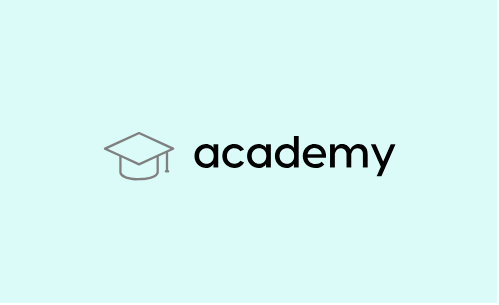

# Projet 2 - OpenClassrooms : ANALYSEZ DES DONNEES DE SYSTEMES EDUCATIFS

<u>*Auteur : Maxime SCHRODER*</u>

## Contexte

  

Vous êtes Data Scientist dans une start-up de la EdTech, nommée academy, qui propose des contenus de formation en ligne pour un public de niveau lycée et université.

Mark, votre manager, vous a convié à une réunion pour vous présenter le projet d’expansion à l’international de l’entreprise. Il vous confie une première mission d’analyse exploratoire, pour déterminer si les données sur l’éducation de la banque mondiale permettent d’informer le projet d’expansion.

## Données
Les données de la Banque Mondiale sont disponibles à l'adresse suivante: https://datacatalog.worldbank.org/dataset/education-statistics

## Mission 
- Validation de la qualité du jeu de données
- Sélectionner les informations qui semblent pertinentes pour répondre à la problématique
- Détemriner dans quels pays l'entreprise doit opérer en priorité

## Construction

Dans ce dépôt, vous trouverez :
1. Le notebook comportant l'analyse exploratoire, les créations de différents score et classement de pays/régions pour répondre à la problématique : Notebook.ipynb
2. Le support de présentation : Présentation.pdf.
3. Le logo de la société : logo_academy.png.
4. Les fichiers pour la mise en place de l'environnement virtuel avec poetry : pyproject.toml et poetry.lock 